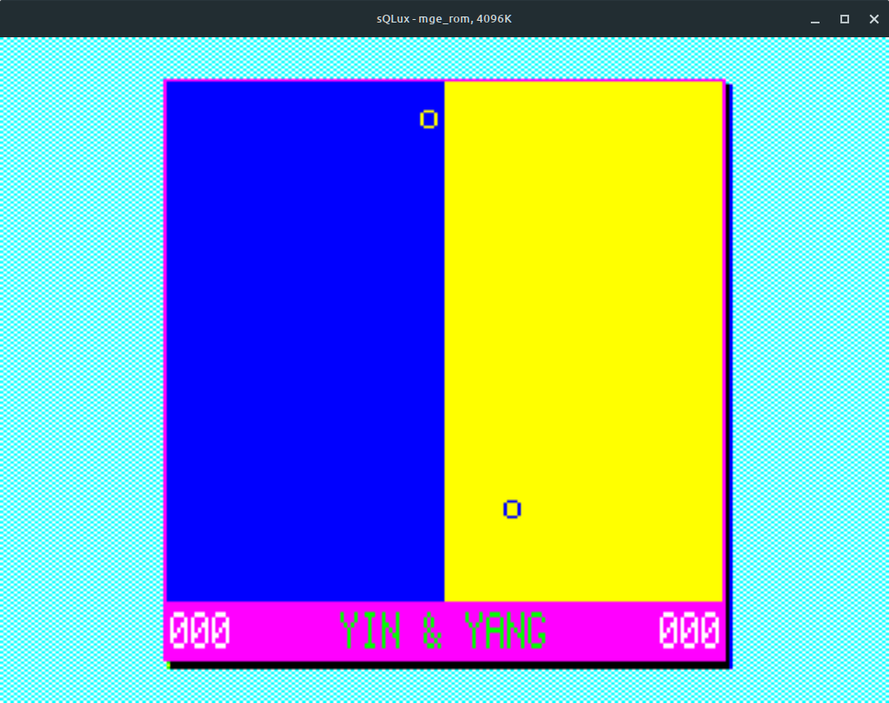

# Sinclair QL YinYang

Este repositorio contiene las diferentes entregas de la demo YinYang creada para enseñar programación en lenguaje SuperBASIC.

Encontrarás el código de las distintas versiones del programa en la carpeta `src`.

Las explicaciones acerca del desarrollo de la demo comienzan en esta entrada de QBlog:

[Programando mi primera Demo en QL – fascículo I, los preparativos](https://sinclairqles.wordpress.com/2024/03/16/programando-mi-primera-demo-en-ql-fasciculo-i-los-preparativos/)

Y puede leerse en capítulos sucesivos enlazados desde esa entrada.

Estas explicaciones también fueron publicadas en RetroWiki:

https://retrowiki.es/viewtopic.php?f=98&t=200040237

Este contenido está basado en la demo `PongWars`. El código en JavaScript y el video puede verse aquí: https://github.com/vnglst/pong-wars